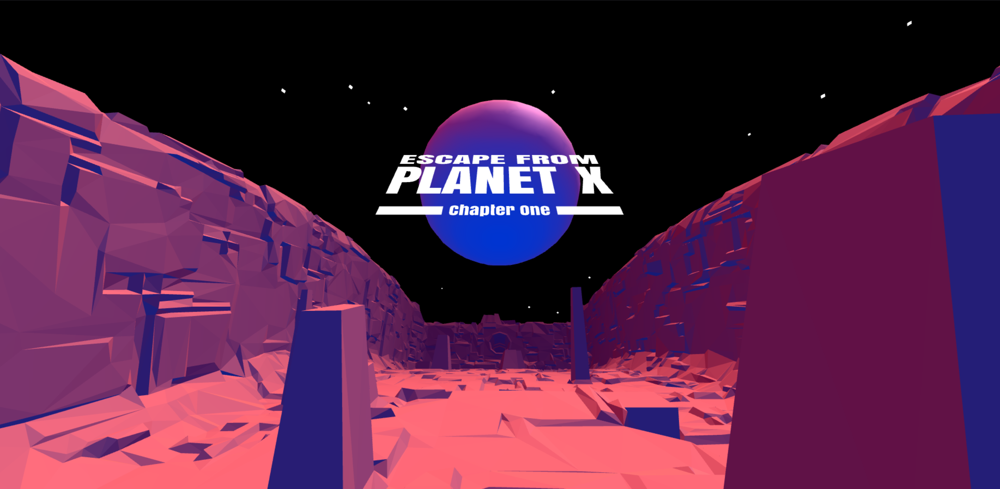

# Escape from Planet X

Exploring A‑Frame and WebXR, this is a small WebVR scene built as a self‑promotion/portfolio demo. It renders a rotating megastructure with a starfield and planet while a short, timed narrative fades in and out as on‑screen text. Works on desktop and in VR on supported browsers.



## Quick start (run locally)

A local web server is recommended (most browsers restrict loading glTF/GLB via file://).

- Python 3 (Windows/macOS/Linux)
  ```
  # Windows (if 'py' works)
  py -m http.server 8080
  # Or (if 'python' works)
  python -m http.server 8080
  ```
  Then open http://localhost:8080

- Node.js (zero‑install via npx)
  ```
  npx serve -l 8080 .
  # or
  npx http-server -p 8080 .
  ```
  Then open http://localhost:8080

- VS Code
  - Install the “Live Server” extension, right‑click index.html, and choose “Open with Live Server”.

Note: WebXR (VR) typically requires a secure context (https or http://localhost).

## Controls

- Desktop: Mouse/trackpad to look
- VR: Click the “Enter VR” button (A‑Frame adds this on supported devices/browsers). Headset controls camera look.

## Features

- A‑Frame 1.2.0
- GLTF/GLB assets:
  - `assets/trench.glb` (rotating structure)
  - `assets/starfield.gltf`
  - `assets/planetx2.glb`
  - `assets/titlex.gltf`
- Cinematic narrative overlay:
  - 8 timed MSDF‑text panels with fade‑in/out animations
  - Schedule (ms): 27000, 53000, 79000, 104000, 130000, 155000, 181000, 207000
  - Dwell/hold (ms): 14000, Fade‑in (ms): 3000
- Scene fog with selective opt‑out:
  - Custom `no-fog` component disables fog on a model’s materials to keep starfield/planet/title crisp
- Simple lighting (hemisphere + directional)

## Project structure

- `index.html` — main A‑Frame scene, text sequencing logic, components
- `assets/`
  - `planetx2.glb`
  - `starfield.gltf`
  - `titlex.gltf`
  - `trench.glb`
  - `screenshot.png`

## How it works

- Fog and no‑fog:
  - The scene uses `fog="type: linear; color: #330033; near: 1; far: 1500"`.
  - Entities with the `no-fog` component disable fog on all their loaded model materials:
    ```js
    AFRAME.registerComponent('no-fog', {
      init: function () {
        this.el.addEventListener('model-loaded', () => {
          this.el.object3D.traverse((node) => {
            if (node.material) node.material.fog = false;
          });
        });
      }
    });
    ```
- Narrative text:
  - MSDF text mixin uses the Roboto font from the A‑Frame CDN.
  - A script sets the `texts` array values on `#text1`..`#text8` and schedules show/fade events using `schedule`, `hold`, and `fadeInDur`.

## Customize

- Edit narrative: In `index.html`, update the `texts` array to change the story.
- Timing: Adjust `schedule`, `hold`, and `fadeInDur` in the same script.
- Fog behavior: Change the `fog` attribute on `<a-scene>`; add/remove `no-fog` on specific entities as needed.
- Models: Replace files in `assets/` and update the corresponding `<a-asset-item>` sources/IDs.

## Browser & VR support

- Desktop: latest Chrome/Edge/Firefox with WebGL enabled.
- VR: Requires a WebXR‑capable browser and device; must be served over https or `http://localhost`.

## Acknowledgements

- [A‑Frame](https://aframe.io/)
- Roboto MSDF font from the A‑Frame CDN

## License

No license file is present in this directory. Code and assets are provided as‑is for demo/portfolio purposes.
